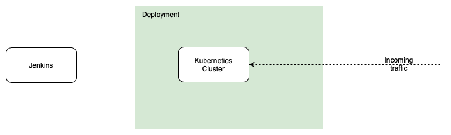
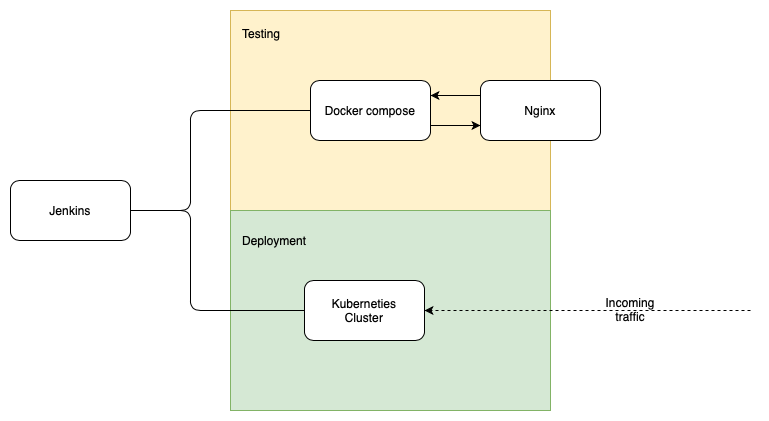
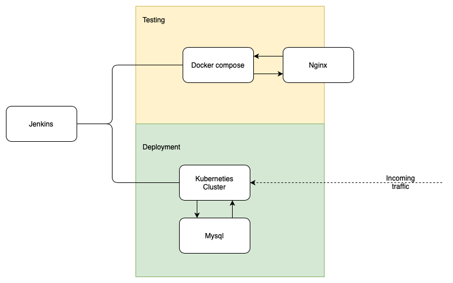

# Final_project

Last project deployment of a full app spring pet clinic app using an [angular front end]( https://github.com/spring-petclinic/spring-petclinic-angular) and a [rest back end](https://github.com/spring-petclinic/spring-petclinic-rest).

## Contents
* [Run instructions](#RI)
* [Project breif](#PB)
* [Introduction](#Intro)
* [MoSCoW priority](#MOSCOW)
* [Service Infrastructure](#SI)


<a name="RI"></a>
## Run instructions

<a name="PB"></a>
## Project 
* Plan, design and implement a solution for automating the deployments and development workflows.
* Have multiple enviroment support.
* Have automatic deployments based on triggers from changes to the github repositry.
* Have a costing of the solution implmented.

<a name="Intro"></a>
## Introduction 


<a name="US"></a>
## User stories
We created our user stories to get an idea of how we wanted to deploy the app. These stories where stored on the [project board](https://github.com/B-R-H/Final_project/projects/2).

From the user stories we created isues that could then be put into sprint boards that where housed inside the reposotry as projects.

<a name="MOSCOW"></a>
## MoSCoW priority
To give clarity on what tasks needed to be run first we prioritise. This was done using custom labels for the github issues wich allowed us to search by urgency.

<a name="SI"></a>
## Service Infrastructure
Our current service infrastructure looks like this.

This implemtation has the testing done on the vm with jenkins on it using docker. The main deploymnt is then done using a managed kuberneties service on azure.

All of the infrastructure can be spun up using terrafrom scripts that use an azure subcription. The scripts are designed in such a way that they pull the terraform workspace to use as the the name of the resources being deployed. This allows for identical infrastructure to be spun up for developers to test new features on more exstensivly if the automated test arn't surficent.

### Kubernetis terraform use
To run the Kubernetes terraform files you will need to have a service principle set up and have the client id and client secret on hand. If not these can be configured using the azure cli with\
```az ad sp create-for-rbac --role="Contributor" --scopes="/subscriptions/your_subscription_id"```
To link it to kubectl you will need to run\
```echo "$(terraform output kube_config)" > ~/.kube/azurek8s```
And\
``` export KUBECONFIG=~/.kube/azurek8s```

### Previous versions 
<details>
<summary>Exspand to see the previous iterations of the infrastucture design</summary>

#### Mark 1

The first idea had a completly seprate testng enviroment with on vm to run the app on using docker and then a second vm running nginx to proxy pass to the dcker vm. The Jenkins vm is only used for Jenkins and has access to the testing and production enviroments. The deployment is done though a managed kubernetues cluster with a nginx load ballencer service.

#### Mark 2 

The second design varied only slightly from the first the only difrence was that the database was going to use a managed databse service to allow for the data to be more sercure and able to scale better.


</details>

