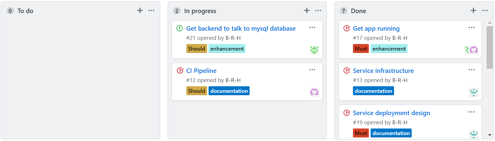

# Final_project

Last project deployment of a full app spring pet clinic app using an [angular front end]( https://github.com/spring-petclinic/spring-petclinic-angular) and a [rest back end](https://github.com/spring-petclinic/spring-petclinic-rest).

## Contents
* [Run instructions](#RI)
* [Project brief](#PB)
* [Introduction](#Intro)
* [MoSCoW priority](#MOSCOW)
* [Sprint Discussion](#Sprint_Discussion)
* [Service Infrastructure](#SI)
* [Continuous integration pipeline](#CI)
* [Risk assessment](#RI)
* [Testing](#test)
  - [Front end](#FET)
  - [Back end](#BET)
  - [End to end](#e2e)
* [Cost analysis](#CA)
* [Conclusion](#conclusion)

<a name="RI"></a>
## Run instructions

<a name="PB"></a>
## Project 
* Plan, design and implement a solution for automating the deployments and development workflows.
* Have multiple enviroment support.
* Have automatic deployments based on triggers from changes to the github repositry.
* Have a costing of the solution implmented.

<a name="Intro"></a>
## Introduction 


<a name="US"></a>
## User stories
We created our user stories to get an idea of how we wanted to deploy the app. These stories where stored on the [project board](https://github.com/B-R-H/Final_project/projects/2).

From the user stories we created isues that could then be put into sprint boards that where housed inside the reposotry as projects.

<a name="MOSCOW"></a>
## MoSCoW priority
To give clarity on what tasks needed to be run first we prioritise. This was done using custom labels for the github issues wich allowed us to search by urgency.

<a name="Sprint_Discussion"></a>
## Sprint Discussion
### Friday Sprint 
First day of the project. This saw us plan the project and our workload for the coming week. This went well and we had time to look over the repositories we were working with and have a play about with them. This put us in good stead for our first sprint Monday.


### Sprint 1
The first day of actual project work was successful. As the image below shows we were able to get most of the jobs for that day complete, only carrying over 2 jobs to the next day.


### Sprint 2
Tuesday was a slower day with some more challenging tasks across the board. Only 4 tasks got fully completed and each member of the team was stuck on individual problems throughout the day. In particular, the mysql database proved to be a real struggle. It was agreed that this would be put on hold in order to get other things completed.


### Sprint 3
Wednesday was more successful than the previous day. The problems people were stuck on previously had been solved and the project was looking good for Thursday’s sprint.


### Sprint 4
This was the final sprint for the group and Wednesday had left us in a good place to finish up today. We had to finalise the Jenkins job and get the kubernetes deployment working properly. Also finish off the powerpoint and documentation ready for practice runs on Friday morning.


<a name="SI"></a>
## Service Infrastructure
Our current service infrastructure looks like this.


This implemtation has the testing done on the vm with jenkins on it using docker. The main deployment is then done using a managed kuberneties service on azure.

All of the infrastructure can be spun up using terrafrom scripts that use an azure subcription. The scripts are designed in such a way that they pull the terraform workspace to use as the the name of the resources being deployed. This allows for identical infrastructure to be spun up for developers to test new features on more exstensivly if the automated test arn't surficent.

### Kubernetes terraform use
To run the Kubernetes terraform files you will need to have a service principle set up and have the client id and client secret on hand. If not these can be configured using the azure cli with\
```az ad sp create-for-rbac --role="Contributor" --scopes="/subscriptions/your_subscription_id"```
To link it to kubectl you will need to run\
```echo "$(terraform output kube_config)" > ~/.kube/azurek8s```
And\
``` export KUBECONFIG=~/.kube/azurek8s```

### Previous versions 
<details>
<summary>Exspand to see the previous iterations of the infrastucture design</summary>

#### Mark 1


The first idea had a completly seprate testng enviroment with on vm to run the app on using docker and then a second vm running nginx to proxy pass to the dcker vm. The Jenkins vm is only used for Jenkins and has access to the testing and production enviroments. The deployment is done though a managed kubernetues cluster with a nginx load ballencer service.

#### Mark 2 


The second design varied only slightly from the first the only difrence was that the database was going to use a managed databse service to allow for the data to be more sercure and able to scale better.


</details>

<a name="CI"></a>
## CI pipeline

In the CI pipeline we have used git for our source controll, the infrastructure is built using terraform and then configured using ansible. Jenkings was chosen as to manage our continous intergration and the production deployment is done on Azure using Kubernetties.


<a name="RI"></a>
## Risk assessment


<a name="test"></a>
## Testing

<a name="FET"></a>
### Front end

The front end tests are run through a browser using one of the testing images of the front end the current testing image is labled T1. To access the tests you will need to navigate to ip of the machine that the test are run on port 9876 and then on the webpage it will have a button that says debug. When that button is pressed it tests all of the routing for the front end.


<a name="BET"></a>
### Back end 
To test the back end the reposity that contains the code and then run the `mvn test` command. If you want to test that the docker image that you are running then you need to exec into the container and run `/mvnw test`. These commands run the same tests that cover the entire backend.


<a name="e2e"></a>
### End to end

The end to end tests are run from the front end immage agian and spin up a virtual testing enviroment to test them. This is done using the fronend image T2 which automaticly starts the tests on start up. Unfourtantly the virtual browser that it is tryng to spin up is currently breaking on start up so the tests arn't running correctly. We have tried pointing the tests to other supported browsers but unfourtantly they are not being pulled down correctly so these tests are currently not in a functional state.

<a name="CA"></a>
## Cost analysis
With our current infrastructure the cost isn't fixed for a mont because the Kubernetties cluster has auto scaling up to 3 nodes by default but if demand was high this could be exspanded. This does give us a band under normal operation that this deployment would cost.

The vm sizes for the project are as follows.\
    Jenkins VM: DS1 V2 (1vCPU core 3.5GB RAM)\
    Kubernities nodes: DS1 V2 (1vCPU core 3.5GB RAM)

The minium cost per month with this set up is £95.58 this assumes that the Kubernetties cluster only ever has one vm in the node. The maximum monthly cost would be £191.12 but this requires the node to be scaled up to the maximum number of VMs all of the time wich would be unlikley to happen and if it was happening you would need to look at provisioning more infrastructure in anycase. The full breakdown of the costs can be found [here](Documents).


<a name="conclusion"></a>
## Conclusion

Overall this project has been a success. The group worked well together and the final product meets the project brief. The use of GitHub project boards and the issue queue was particularly useful in delegating tasks and organising the team. Moving forward with the project we would like to get a managed MySQL instance working with the application for better workflow across the project.
